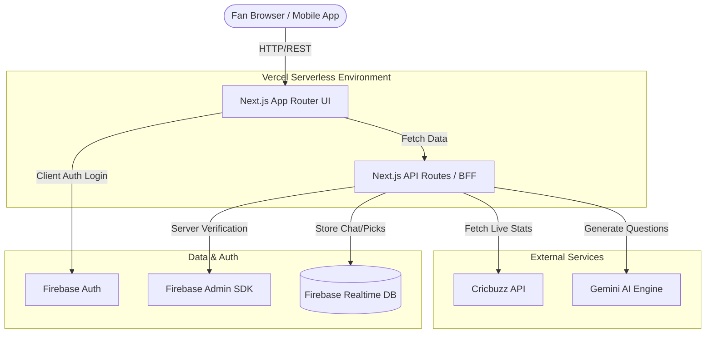
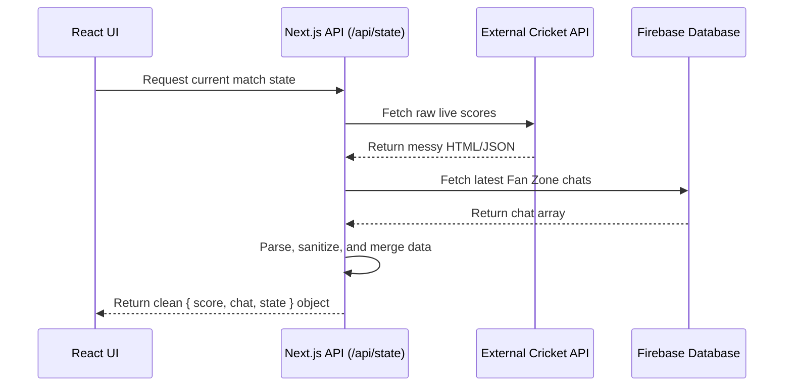
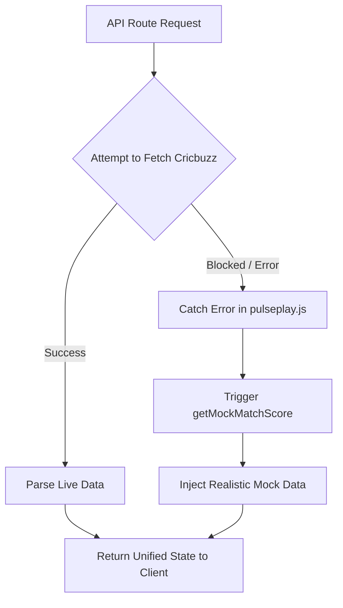

# Pulse Play Architecture & System Design

Pulse Play is a robust, real-time "second-screen" application designed for cricket fans. It is built as a single, scalable Next.js application, currently hosted at `https://pulseplay-apl.vercel.app`. This document outlines the architectural patterns, data flow, and resilience strategies used to build the platform.

## High-Level System Architecture

The application relies on a Serverless Architecture deployed on Vercel, allowing it to seamlessly scale during high-traffic live match events.

## Backend-For-Frontend (BFF) Pattern

Instead of the React client directly querying messy external data sources, the Next.js API routes (`frontend/app/api/*/route.js`) act as a **Backend-For-Frontend**. 

This layer orchestrates data from multiple sources, sanitizes it, and serves the exact shape of data the frontend requires.

### Key Backend Components:
- **`frontend/app/api/*/route.js`**: Serverless endpoints that replace traditional monolithic backends.
- **`frontend/lib/pulseplay.js`**: The core business logic engine. It handles live match discovery, Cricbuzz score scraping and parsing, Gemini prediction question generation, chat processing, and points calculation.
- **`frontend/lib/firebaseAdmin.js`**: Securely verifies user Firebase ID tokens on the server and connects API routes to the Realtime Database.

## Resilience & Graceful Degradation

Live sports data APIs are notorious for blocking server IPs (like Vercel or AWS) to prevent scraping. Pulse Play implements a robust resilience strategy to ensure the app never crashes during an IP block.

If the primary data pipeline fails, the system automatically falls back to `getMockMatchScore`. The UI remains functional, and users can continue interacting with the app, oblivious to the backend failure. 

## Frontend Architecture

The user interface is built using React 18/19 within the Next.js App Router framework. It employs a component-based structure to isolate state and maximize reusability.

- **`frontend/app/page.jsx`**: The main entry point rendering the Pulse Play application.
- **`frontend/src/App.jsx`**: The orchestrator for the live room. It manages heavy client-side state, including the active tab, authentication modals, player data, and real-time polling intervals.
- **`frontend/src/components/`**: Modular views isolated by feature (`DashboardTab`, `TimelineTab`, `PicksTab`, `FanZoneTab`, `TacticalTab`, and `Header`).

### State & Styling
- **Polling**: Instead of expensive WebSockets, the React client uses `useEffect` and `setInterval` to poll the BFF API, simulating a real-time experience while keeping infrastructure costs low.
- **Theming**: The application uses Vanilla CSS (`index.css`) powered by CSS Variables. This allows for dynamic Light/Dark mode toggling and intricate Glassmorphism aesthetics without the overhead of heavy utility libraries like Tailwind.

## Pulse Pick Agent (AI Integration)

The platform features an intelligent agent that generates contextual prediction questions during the match. It operates in 3-ball windows:

1. **Context Building**: Gathers the live score, current striker, bowler, required run rate, and recent ball history.
2. **AI Generation**: Uses the Gemini API (`GEMINI_API_KEY`) to generate a unique, highly contextual prediction question for the fans.
3. **Fallback**: If the AI API fails or is unconfigured, it gracefully falls back to local, pre-written templated questions.
4. **Resolution**: Closes the voting window and automatically resolves winners based on the live score delta.

## Deployment Strategy

The application is deployed directly from the `frontend` directory to Vercel. 
- **Serverless Scaling**: Vercel automatically scales the API routes (Serverless Functions) to handle sudden spikes in concurrent users when a match gets exciting.
- **Environment Management**: Environment variables (Firebase keys, Gemini API keys, etc.) are securely managed within Vercel's Project Settings.
