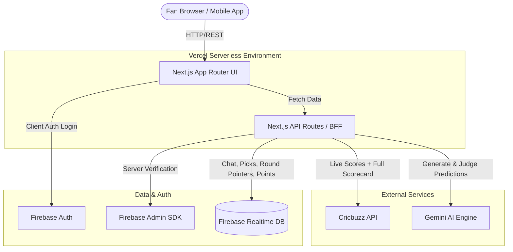
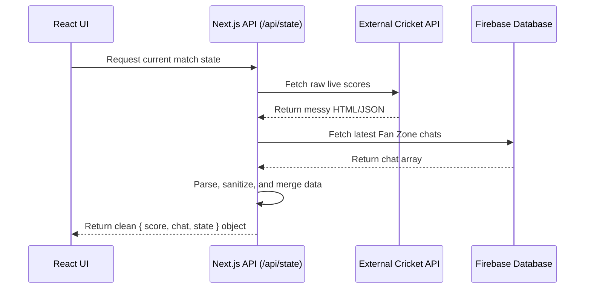
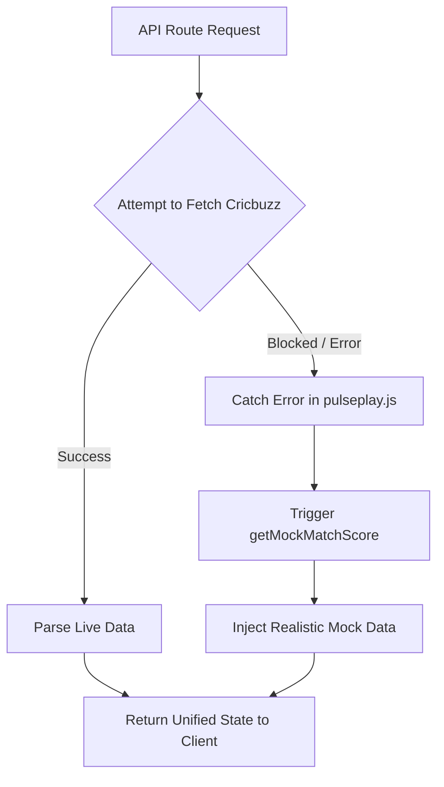

# Pulse Play Architecture & System Design

Pulse Play is a robust, real-time "second-screen" application designed for cricket fans. It is built as a single, scalable Next.js application, currently hosted at `https://pulseplay-apl.vercel.app`. This document outlines the architectural patterns, data flow, and resilience strategies used to build the platform.

## High-Level System Architecture

The application relies on a Serverless Architecture deployed on Vercel, allowing it to seamlessly scale during high-traffic live match events.

## Backend-For-Frontend (BFF) Pattern

Instead of the React client directly querying messy external data sources, the Next.js API routes (`frontend/app/api/*/route.js`) act as a **Backend-For-Frontend**. 

This layer orchestrates data from multiple sources, sanitizes it, and serves the exact shape of data the frontend requires.

### Key Backend Components:
- **`frontend/app/api/*/route.js`**: Serverless endpoints that replace traditional monolithic backends.
- **`frontend/lib/pulseplay.js`**: The core business logic engine. It handles live match discovery, Cricbuzz score scraping and parsing, Gemini prediction question generation, chat processing, and points calculation.
- **`frontend/lib/firebaseAdmin.js`**: Securely verifies user Firebase ID tokens on the server and connects API routes to the Realtime Database.

## Resilience & Graceful Degradation

Live sports data APIs are notorious for blocking server IPs (like Vercel or AWS) to prevent scraping. Pulse Play implements a robust resilience strategy to ensure the app never crashes during an IP block.

If the primary data pipeline fails, the system automatically falls back to `getMockMatchScore`. The UI remains functional, and users can continue interacting with the app, oblivious to the backend failure. 

## Frontend Architecture

The user interface is built using React 18/19 within the Next.js App Router framework. It employs a component-based structure to isolate state and maximize reusability.

- **`frontend/app/page.jsx`**: The main entry point rendering the Pulse Play application.
- **`frontend/src/App.jsx`**: The orchestrator for the live room. It manages heavy client-side state, including the active tab, authentication modals, player data, and real-time polling intervals.
- **`frontend/src/components/`**: Modular views isolated by feature — `Header` (live scoreboard with both batters and the bowler), `DashboardTab` (Arena), `TimelineTab` (Plays), `PicksTab`, `ScorecardTab` (full batting/bowling card), and `FanZoneTab` (Room).

### State & Styling
- **Polling**: Instead of expensive WebSockets, the React client uses `useEffect` and `setInterval` to poll the BFF API, simulating a real-time experience while keeping infrastructure costs low.
- **Match pinning**: The client is the source of truth for which match it is viewing. Once a match is resolved (or the fan switches games), the client pins its GUID and passes `?match=<guid>` on every read. This keeps the view stable across stateless serverless invocations, which do not share the in-memory "active match" — without it, each poll could fall back to a different "first live" match and the view would flip.
- **Theming**: The application uses Vanilla CSS (`index.css`) powered by CSS Variables for a refined, minimal design system with dynamic Light/Dark toggling — no heavy utility libraries like Tailwind.

## Pulse Pick Agent (AI Integration)

The platform features an intelligent agent that reads the live scorecard and runs one prediction round per match at a time. Each round watches a window of a few balls (AI-chosen, clamped to 3–12) before it resolves.

1. **Context Building**: Gathers the live scorecard — both batters (runs, balls, strike rate), the bowler's figures, partnership, required run rate, recent deliveries, and match situation. Balls remaining are derived from live data (the status line or required run rate), not a hardcoded innings length.
2. **AI Generation**: Uses the Gemini API (`GEMINI_API_KEY`) to invent a varied, contextual question with its own 2–4 choices and a resolution horizon (e.g. runs off the next over, a wicket in the window, a batter reaching a milestone).
3. **Fallback**: If Gemini is unconfigured or fails, it falls back to local self-resolvable templated questions.
4. **Resolution (AI umpire)**: When the window's balls have been bowled, the observed outcome (runs, wickets, deliveries) is passed back to Gemini, which picks the winning choice; a keyword/number heuristic is the offline fallback. Interrupted windows (innings change, end of play) are voided. Winners are awarded Pulse Points, and each submission is stored with its `pickId`/`questionId`, `matchGuid`, `userId`, and answer.

The active round and last-resolved round are tracked per match via Realtime Database pointers, so rounds stay consistent across serverless invocations.

## Deployment Strategy

The application is deployed directly from the `frontend` directory to Vercel. 
- **Serverless Scaling**: Vercel automatically scales the API routes (Serverless Functions) to handle sudden spikes in concurrent users when a match gets exciting.
- **Environment Management**: Environment variables (Firebase keys, Gemini API keys, etc.) are securely managed within Vercel's Project Settings.
