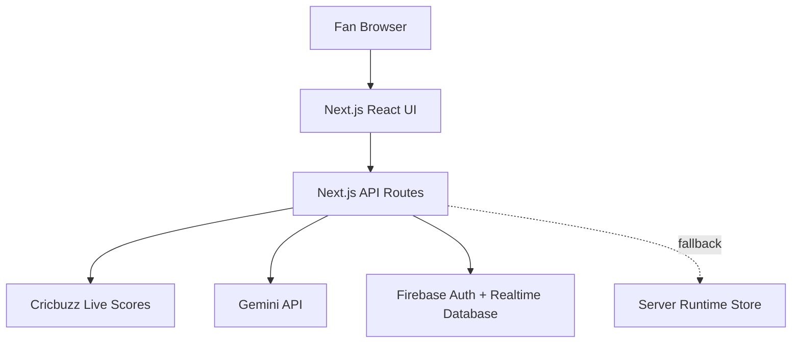

# Pulse Play Architecture

Pulse Play runs as one deployable Next.js application, currently hosted at `https://pulseplay-apl.vercel.app`.

## Frontend

- `frontend/app/page.jsx` renders the Pulse Play app.
- `frontend/src/App.jsx` owns the live room state, auth modal, tabs, and polling.
- `frontend/src/components/` contains the dashboard, timeline, picks, fan room, tactical, and header views.

## Backend

- `frontend/app/api/*/route.js` files replace the previous separate backend.
- `frontend/lib/pulseplay.js` contains live match discovery, Cricbuzz score parsing, Gemini question generation, pick-round resolution, chat, and points.
- `frontend/lib/firebaseAdmin.js` verifies Firebase ID tokens and connects API routes to Realtime Database.
- `frontend/src/firebaseClient.js` powers Firebase email/password login in the browser.

## Pulse Pick Agent

The agent creates one active pick round per 3-ball window:

- builds context from live score, striker, bowler, required rate, and recent balls
- asks Gemini for a concise fan prediction question when `GEMINI_API_KEY` is present
- falls back to local question wording otherwise
- closes by timer or ball window
- resolves winners from live score delta

## Deployment

The app deploys from the `frontend` directory on Vercel. Environment variables are configured in Vercel Project Settings.
